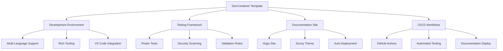

{}
**Welcome to the DevContainer Template Project!**

This is a modern, comprehensive development container template featuring automated testing, documentation, and CI/CD workflows. The template is designed for rapid project setup with industry best practices.

**Latest Update:** Fixed GitHub Actions workflow for reliable documentation deployment ✅
{}

# DevContainer Template

A comprehensive, modern development container template featuring:

- **🐳 Multi-Language Support**: Terraform, Bicep, PowerShell, and more
- **🧪 Automated Testing**: Pester-based validation with comprehensive test coverage
- **📚 Beautiful Documentation**: Hugo-powered site with automatic deployment
- **🔧 Rich Tooling**: Pre-configured with essential development tools
- **⚡ Quick Setup**: One-command initialization and configuration
- **🔒 Security**: Built-in security scanning and validation
- **🚀 CI/CD Ready**: GitHub Actions workflows for automation

## Quick Start

Get started with your development environment in minutes:

```bash
# Clone the template
git clone https://github.com/haflidif/devcontainer-template.git
cd devcontainer-template

# Initialize (PowerShell)
.\Initialize-DevContainer.ps1

# Run tests
.\tests\Validate-DevContainer.ps1

# Set up documentation site
.\docs\Setup-Hugo.ps1 -Serve
```

## What's Included

### Development Tools
- **Terraform** with validation, formatting, and security scanning
- **Azure Bicep** with compilation and linting
- **PowerShell** with modern modules and accelerators  
- **Security Tools**: TFSec, Checkov, PSRule
- **Documentation**: Hugo with Docsy theme

### Testing & Validation
- **Pester Tests**: Comprehensive validation suite
- **Syntax Checking**: Multi-language syntax validation
- **Security Scanning**: Automated security checks
- **Configuration Validation**: Environment and setup verification

### Documentation & Automation
- **Hugo Site**: Modern documentation with search and navigation
- **GitHub Actions**: Automated testing and deployment
- **VS Code Tasks**: Integrated development workflows
- **PowerShell Modules**: Custom accelerator functions

## Architecture

This template provides a complete development ecosystem:



Ready to get started? Check out our [Getting Started Guide](getting-started/) or explore the [Examples](examples/)!
